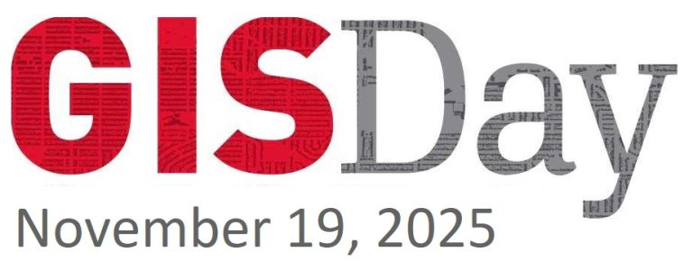

::: centered-page-content
IKB Library, University of British Columbia, BC, CA

GIS Day is an annual worldwide celebration of Geographic Information Systems (GIS) technology and community, dedicated to promoting geospatial literacy, education, and awareness. This event brings together **students, educators, researchers, and industry professionals** who share an interest in geography, cartography, remote sensing, spatial data science, and related fields.

<https://gis.ubc.ca/event/gis-day-2025/>
:::
