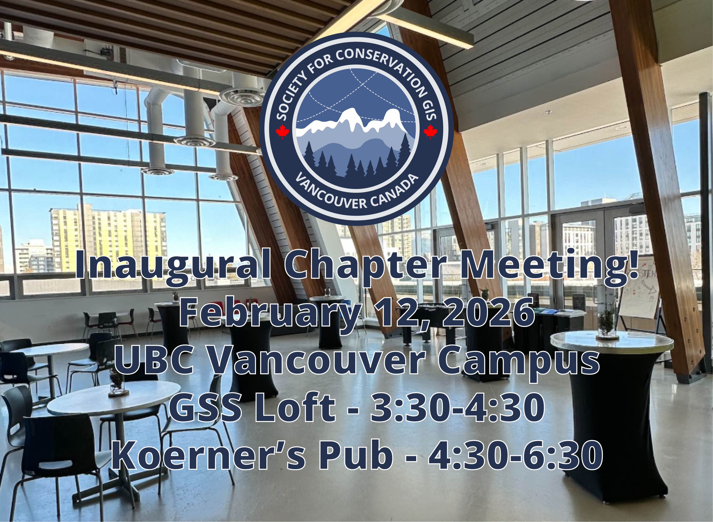

::: centered-page-content
We're kicking off the Vancouver chapter with a talk and mixer event!

Join us for an afternoon of conversation, idea-sharing, and networking with folks who are passionate about conservation and spatial thinking. We're excited to welcome guest speaker **Pano Skrivanos**, founder of [Overstory Mapping & Research](https://www.overstorymapping.ca/), who will share insights on the current landscape of conservation GIS including its strengths, limitations, and where the field is headed.

We'll also be hosting a collaborative brainstorming session focused on what you want to see: What skills do you want to learn? Who do you want to hear from? What conversations should this chapter be leading?

This event is free and open to conservation GIS enthusiasts from all sectors and experience levels.

**Chapter Discussion & Guest Speaker**\
3:30–4:30 PM\
UBC GSS Loft, 6133 University Blvd

**Social Mixer**\
4:30–6:00 PM\
Koerner's Pub, 1758 West Mall

:::
