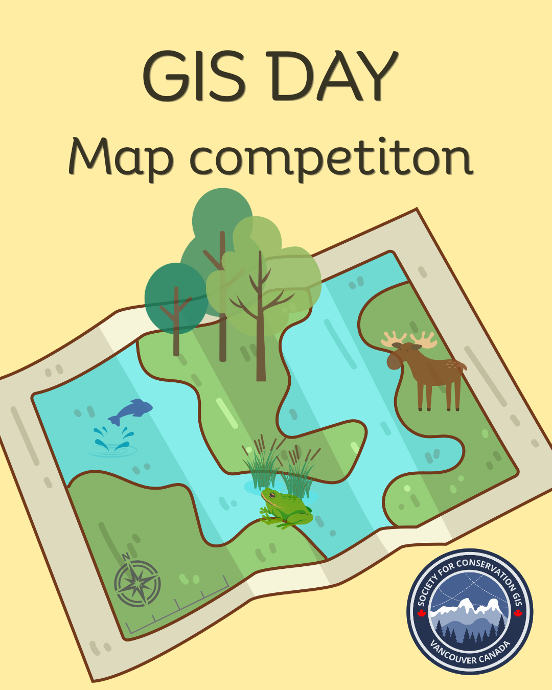

::: centered-page-content
{fig-align="center" width="420"}

In celebration of International GIS Day (November 18), the Vancouver Chapter of the Society for Conservation GIS (SCGIS) invites mapmakers of all backgrounds and experience levels to participate in our inaugural "Maps for Conservation" competition.

The challenge is to create a compelling map that explores, communicates, or celebrates a conservation-related theme. Submissions may focus on any location in the world and can address conservation broadly, including biodiversity, wildlife, ecosystems, protected areas, environmental change, restoration, natural resources, climate impacts, human–environment interactions, or other conservation challenges. Maps focused on Vancouver, British Columbia, and Canadian conservation issues are particularly encouraged, but a local focus is not required.

We welcome entries from students, professionals, researchers, GIS enthusiasts, and anyone interested in using maps to communicate conservation stories.

**Deadline:** Wednesday, November 11, 2026\
**Winners announced:** [GIS Day](2026-11-gis-day.qmd), Wednesday, November 18, 2026

## Prizes {#prizes}

-   The first-place winner will receive a copy of *Atlas of the Invisible: Maps & Graphics That Will Change How You See the World* by James Cheshire and Oliver Uberti.
-   The top three entries will be featured on SCGIS Vancouver's social media and circulated to our [mailing list](../mailing_list.qmd), alongside their map descriptions and information about the mapmakers.
-   The authors of the top three entries will be invited to present their maps and the work behind them at a future SCGIS Vancouver event, providing an opportunity to share their conservation story, cartographic approach, and broader work with the GIS community.

## Rules {#rules}

1.  **One submission per participant.** Each participant may submit one map.
2.  **Conservation theme.** The map must have a clearly identifiable conservation theme or application. We encourage creative interpretations of what conservation mapping can encompass.
3.  **Geographic scope.** Maps may depict any location or geographic scale. Local and Canadian themes are encouraged but are not required.
4.  **Map format.** Maps may use either portrait or landscape orientation. Submissions should be provided as a high-resolution PDF.
5.  **Data attribution.** All datasets and basemaps used in the map must be appropriately cited or attributed. Citations must appear directly on the map.
6.  **Map description.** Each entry must include a brief description of the map (suggested maximum: 150–200 words), explaining its conservation context, purpose, and the story or information the map is intended to communicate. If your map is selected as a winning entry, this description will accompany the map on our social media posts.
7.  **Original work.** The submitted map must represent the participant's own cartographic work. Publicly available datasets, basemaps, and other mapping resources may be used, provided they are appropriately acknowledged. Maps developed as part of academic or professional projects are welcome provided the entrant was responsible for the cartographic design. Maps previously published for commercial purposes are not eligible.
8.  **Submission anonymity.** Entrants should not place their name or identifying information prominently on the map. Participant information will be collected separately so that entries can be evaluated anonymously wherever practical.
9.  **Responsible mapping.** Submissions should not disclose sensitive geographic information that could place species, habitats, cultural resources, or communities at risk. Entrants are responsible for ensuring they have permission to use and display any non-public data.
10. **Use of submitted maps.** Entrants retain ownership of their work. By submitting, entrants grant SCGIS Vancouver permission to display the map as part of the GIS Day competition and related non-commercial promotion, with appropriate credit to the creator.

### Judging {#judging}

Judging will focus on the effectiveness of the final map as a conservation communication tool, rather than the complexity of the underlying analysis. Maps will be evaluated on how clearly and effectively they use geographic information, cartographic design, and visual storytelling to communicate their conservation theme. A technically simple map that communicates its message exceptionally well will be considered just as strongly as one based on more complex spatial analyses.

| Criterion | Weight | Question |
|------------------------------|------|--------------------------------------------|
| Conservation relevance and storytelling | 30% | How effectively does the map communicate a meaningful conservation issue, pattern, question, or story? |
| Cartographic design | 30% | Is the map visually effective, legible, well organized, and appropriate for its intended message? |
| Effective use of geographic information | 25% | Does the map make thoughtful and effective use of spatial data, analysis, scale, and geographic context? |
| Creativity and originality | 15% | Does the map demonstrate an engaging, innovative, or distinctive approach to communicating conservation through GIS? |

## Submission {#submission}

Email your entry to [scgis.canada.vancouver\@gmail.com](mailto:scgis.canada.vancouver@gmail.com?subject=Maps%20for%20Conservation%20submission) by **Wednesday, November 11, 2026**. Each submission should include:

-   Your map as a high-resolution PDF (portrait or landscape).
-   Your map description (150–200 words).
-   Your name and affiliation in the body of the email. Keep identifying information off the map itself (Rule 8).

## Gallery {#gallery}

All submitted maps will be featured here as part of our living map gallery once the competition closes. Check back after GIS Day on November 18!

<!-- Add entries after the competition closes, e.g.:
::: {layout-ncol=2}

:::
-->
:::
