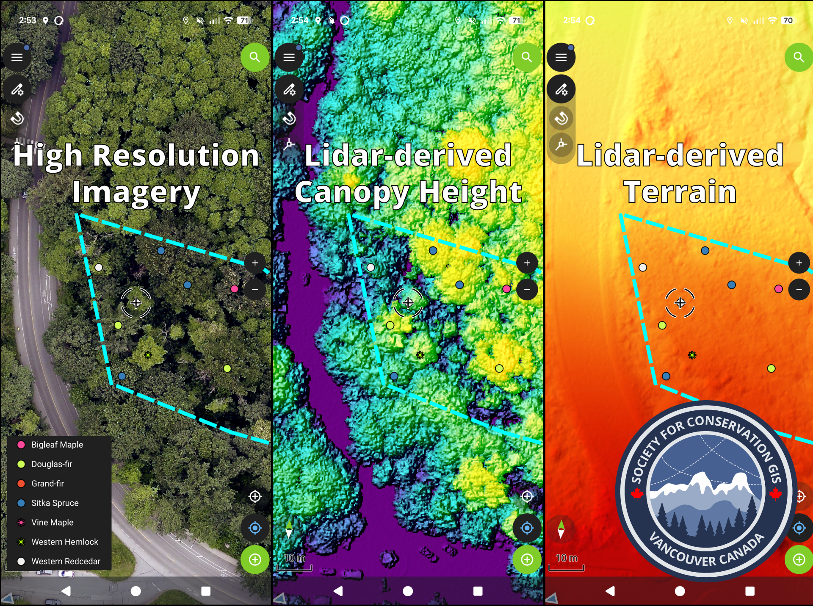

::: centered-page-content
We are currently planning a workshop hosted by SCGIS Vancouver. In this workshop we will generate and gather spatial layers from local open data portals and set them up into a cloud-ready map database powered by open source QGIS and QField\[Cloud\] in a conservation setting, with a case study in a local Vancouver park!

These maps can be synced between field users on mobile (collecting the data) and desktop to provide real-time updates on both ends.

Exact date and details to follow!

:::
